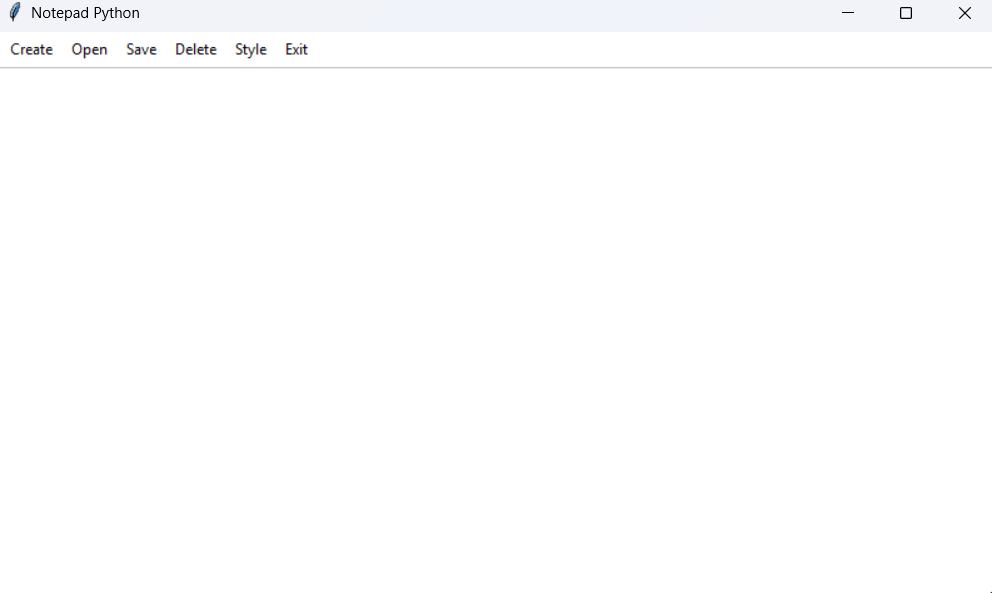

# Notepad Python v2.0.0



## Overview

Notepad Python is a basic, free, lightweight notepad desktop application made entirely in Python. It offers a familiar interface for creating, editing, and managing plain text files, inspired by the simplicity of classic notepad apps found on Windows.

## Features

- **Create, Open, Save, Delete Notes:** Easily manage your text files using the menu options at the top ("Create", "Open", "Save", "Delete").
- **Clean User Interface:** Large, uncluttered writing area—perfect for quick notes and focused editing.
- **Distraction-Free:** Only the basic essential features you expect from a notepad app.

## Screenshot


Above: The main window of Notepad Python, showing the intuitive menu and writing area.

## Getting Started

1. **Clone the Repository**
   ```bash
   git clone https://github.com/Jspahiu/Notepad-Python.git
   ```
   
2. **Run the Application**

   **-------- For Running Python File Itself --------**
   - Make sure you have Python installed (the app uses `tkinter`, which is included in standard Python distributions).
   - Make sure you enter the correct version for the path to the files
  
   
     
   ```bash

   cd Notepad-Python/Notepad Python v1.0.0
   python main_v1.py
   ```

   **-------- For Running Notepad Python on .exe file (WINDOWS ONLY) --------**

   ```bash

   cd Notepad-Python/Notepad Python .exe/v1.0.0
   
   ```
   Run the .exe file named "Notepad Python v1.exe"

## Usage

- Use the menu bar at the top for all major actions: creating, opening, saving, deleting notes, and adjusting style.
- Write your notes in the large central area.
- Exit safely using the "Exit" menu.

## Why Use Notepad-Python?

This app is ideal for anyone who wants a straightforward, reliable notepad with no distractions. It's also a great example for beginners learning how to build desktop apps in Python using Tkinter.

## Contributing

Pull requests and suggestions are welcome! Feel free to fork the repo and improve upon the project!

## Vote

If you are in the Hack Club, feel free to vote for this project for support of future projects!

---

Enjoy using Notepad Python v1.0.0!